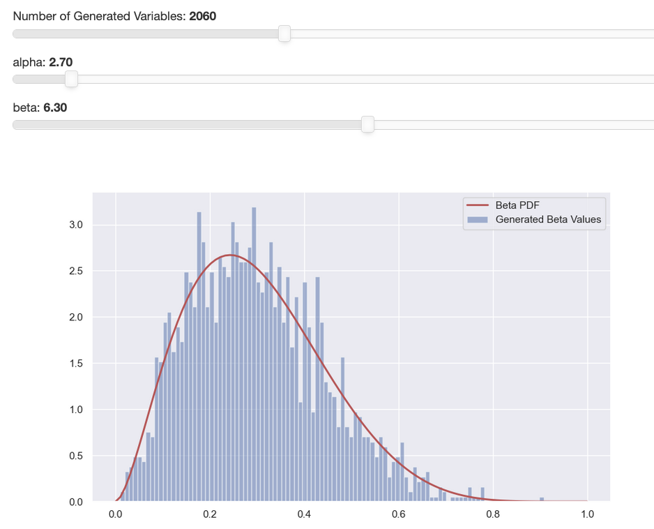

## Portfolio

---

### Deep Learning

[Learning Representations of Molecular Graphs with Graph Isomorphism Network](https://github.com/bparker9/graphnn)

---
[Using Skip Connections to Eliminate Singularities](https://github.com/bparker9/skipconnections)

---

### Data Visualizations

___
[Generating Random Variables](https://github.com/bparker9/generating-random-variables)

---

### Miscellaneous

[A portfolio website](https://github.com/bparker9/portfoliosite)

---

